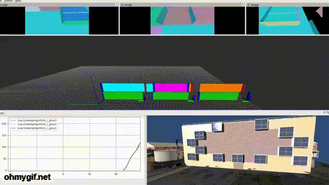

# multi robot sweep coverage
Matlab codes for the paper accepted in IEEE T-SMC.

[](https://youtu.be/nBXupDJ9x94)
## Basic Usage
[sweep.m](https://github.com/caomuqing/multi_robot_sweep_coverage/blob/main/sweep.m) runs the main algorithms.

After running the main algorithms, [sweep_visualization_workload.m](https://github.com/caomuqing/multi_robot_sweep_coverage/blob/main/sweep_visualization_workload.m) and [sweep_visualization_workload2.m](https://github.com/caomuqing/multi_robot_sweep_coverage/blob/main/sweep_visualization_workload2.m) plots the workload distribution progress.

Using the data from the main algorithm, [sweep_animation2.m](https://github.com/caomuqing/multi_robot_sweep_coverage/blob/main/sweep_animation2.m) shows an animation of the robot sweep coverage.

## Citation

If you find this work useful, please cite ([paper](https://ieeexplore.ieee.org/document/10168201), [video](https://youtu.be/nBXupDJ9x94)):

```bibtex
  @ARTICLE{cao2023sweep,
  author={Cao, Muqing and Cao, Kun and Li, Xiuxian and Xie, Lihua},
  journal={IEEE Transactions on Systems, Man, and Cybernetics: Systems}, 
  title={Distributed Control of Multirobot Sweep Coverage Over a Region With Unknown Workload Distribution}, 
  year={2023},
  volume={},
  number={},
  pages={1-13},
  doi={10.1109/TSMC.2023.3285264}}

```
